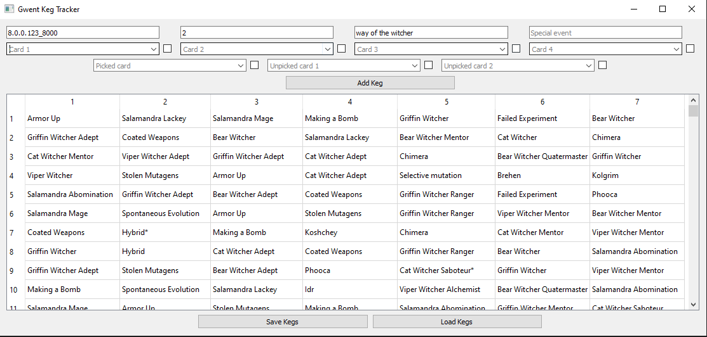
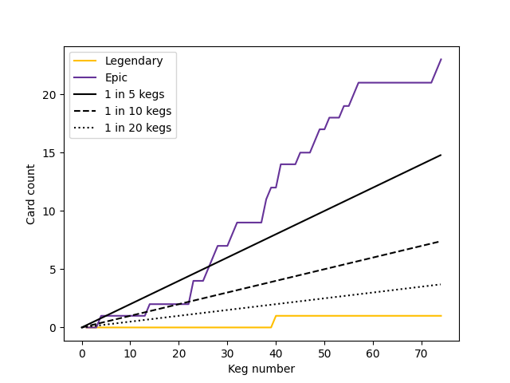

# Gwent-Keg-Tracker

A Python application to track cards pulled from Gwent kegs.

The interface is built with the [PyQt5 framework](https://pypi.org/project/PyQt5/).

To scrape card lists (see [cards.json](cards.json)), I use [Beautiful Soup](https://beautiful-soup-4.readthedocs.io/en/latest/) and [Selenium](https://selenium-python.readthedocs.io/).
Currently, the [gwent.one scraper](gwentone_scraper.py) has the most up-to-date list of cards.

There is also a simple script `keg_stats.py` to analyze and plot card rarity counts:

